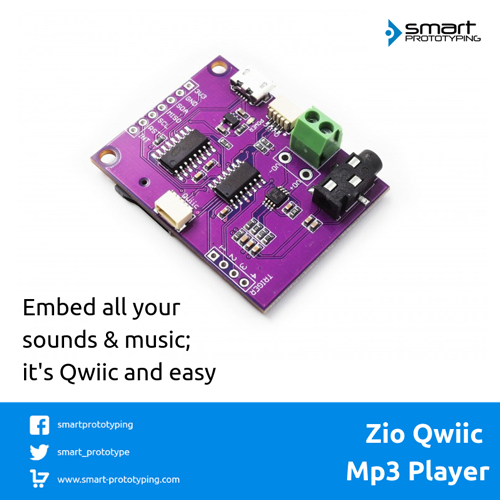

# Zio Qwiic MP3 Player

> This product can be available for purchase [here](https://www.smart-prototyping.com/Zio-Qwiic-MP3-Player).

#### Description

Usually, it is hard to embed sounds into a DIY project, but now we are making it much simpler, the Qwiic version Mp3 player can be very easy to set up and controlled by only writing few lines of commands. No soldering and confusing cable connecting difficulty, only tinkering fun-ness!

Just store the sound files in an Mp3 format to your SD card, plug it into the SD card slot on the module’s backside, and connect a headset/loudspeaker to the 3.5mm audio jack/terminal connector, and you are good to go!

The micro USB connector can connect to your PC and this module can turn into a micro SD card reader, which can be very useful and convenient.

##### How to play soundtracks:

To fully utilized our module, the most useful way is by using code to control everything, including which mp3 file to play, adjusting the volume, equalization, and stereo output.

Or for those of you who are lacking in the programming section, you can opt for the lazy way - give the trigger pins low input, then it will play the corresponding files, like pin #1 will play T001.mp3 file, and pin #3 will play T003.mp3 file, just like that. 

#### Specification

* Operation Voltage: 3.3V
* MP3 IC: WT2003S
* 32 levels volume controlled by code
* Supported SD Card memory: up to 32GB
* Supported File System: FAT16 and FAT32 (Doesn’t Support NTFS)
* Supported audio format: .mp3, .wav
* 3.5mm audio headphone jack
* I2C default address 0x37, can be changed by soldering jumper (the ADDR on the backside)
* I2C gateway MCU: ATTINY84A-SSU
* Dimensions: 45.9x 35.5mm
* Weight: 8.2g

#### Links

* [PCB source file and Gerber file](https://github.com/ZIOCC/Zio-Qwiic-MP3-Player)
* [Schematic](https://github.com/ZIOCC/Zio-Qwiic-MP3-Player/blob/master/Zio%20Qwiic%20MP3%20Player%20Schematic%20PDF.pdf)
* [WT2003S datasheet](https://www.smart-prototyping.com/image/data/NOA-RnD/101942%20MP3%20Player/WT2003S-16S_Chip_V1.03.pdf)
* [Demo code](https://github.com/ZIOCC/Zio-Qwiic-MP3-Player/tree/master/firmware)
* [I2C gateway firmware](https://github.com/ZIOCC/Zio-Qwiic-MP3-Player/tree/master/Gateway_MCU_Firmware)

###### About Zio
> Zio is a new line of open sourced, compact, and grid layout boards, fully integrated for Arduino and Qwiic ecosystem. Designed ideally for wearables, robotics, small-space limitations or other on the go projects. Check out other awesome Zio products [here](https://www.smart-prototyping.com/Zio).
